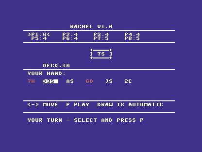
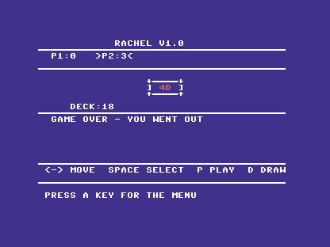

# C64 verification status

## Broader autoplay scenarios, 7 October 2026

The test-only move policy no longer treats an ordinary Ace as wild and no
longer counters the residual draw penalty after a red Jack. These mistakes
were exposed while selecting a native iPhone early-finish scenario. The Go
probe reproduced the earlier 66-turn game exactly before finding rejected
moves in other seeds. Actual assembly regressions then failed on the off-suit
Ace and residual-Jack cases before the fix.

`make autoplay-test` now checks ten cases through the real autoplay routine
and RUBP encoders under the ROM-backed emulator, including Ace suit/rank
matches, nominations, ordinary draws and mandatory counters. Every frame's
CRC is checked. Production transport/pin checks and ACME parity pass; production
keyboard/solo behaviour is unchanged because autoplay is compiled only into
the E2E build. [Red/green and artifact evidence](verification/2026-10-07-autoplay-rules/).

## Native iOS, Android and C64 table, 7 October 2026

C64 `cb0aa70` also completes a second deal with iPhone finishing first at turn
28 and spectating through turn 40. Android finishes second and C64 keeps two
cards; native panels, C64 RAM/screen and all three wire audits agree on hash
`884712020085955646`. Each seat reclaims exactly once and continues. The seed
42 rerun still matches the original 66-turn hash below. Both runs validate
C64's recovered state/hand ACK and every v2 CRC.

[Two-deal evidence and native captures](https://github.com/rachel-multiverse/rachel-ios/tree/saturday-felt/docs/verification/2026-10-07/network-finish-and-spectating)
record the exact test artifacts. The Ace/Jack autoplay correction above leaves
the production PRG unchanged; this adds emulator evidence, not hardware or
production-keyboard verification.

C64 `16f7a9d` completes a 66-turn Go game alongside real iPhone and Android
controls, with no bot seats. Each client reclaims its original seat exactly
once after a forced socket drop and continues. C64 makes 21 accepted actions,
Android 22 and iPhone 23. C64 finishes first, Android second and iPhone last
with seven cards. Both native result panels, C64 RAM/screen and the three wire
audits agree on final hash `12355524258195868592`. C64's v2 CRCs and matching
restored-pair acknowledgement pass.

[Runner, native captures and evidence](https://github.com/rachel-multiverse/rachel-ios/tree/saturday-felt/docs/verification/2026-10-07/three-way-crossplay)
record the initial false-ACK failure, fix and successful rerun. This remains
PAL Ultimate emulator autoplay with native mobile simulator input. Physical
hardware, production C64 keyboard play and public TLS remain separate checks.

## State/hand acknowledgement correction, 7 October 2026

A three-seat iOS/Android/C64 attempt exposed a false ACK while C64 waited for
the other two seats. A public GAME_STATE had arrived without a private HAND_SYNC
for that turn, but the watchdog acknowledged it as a complete pair. Plain
liveness requests now remain requests; ACKs require matching turn, spec version
and state hash from a received HAND_SYNC. Reconnect also waits for that match
before replacing the hand and resuming input. Legacy unnegotiated pairs retain
their existing path.

The corrected conformance expectation failed before the fix with
`mismatched pair must request, not ACK got=0x03 want=0x01`. Three encoder checks,
46 decoder/request checks, 22 pair checks and 13 reconnect hydration cases pass.
Production build, transport/pin checks and ACME byte parity pass. The unchanged
strict mixed-game audit subsequently passed as recorded above; physical
hardware support remains unverified.

[Fix evidence](verification/2026-10-07-matching-pairs/) includes the red/green
checks and exact production source/artifact hashes.

## Android and C64 mixed table, 7 October 2026

C64 and native Android now complete a 32-turn game at the same Go table with
no bot seats. Each client makes 16 accepted moves, reclaims its original seat
after one forced drop, receives a matching state/hand pair, and continues.
C64's recovered snapshot acknowledgement is checked as well as its v2 CRCs.
The final Android result, C64 RAM and C64 screen agree with the host: Android
went out and C64 finished last holding two cards.

This scenario exposed Go answering resync requests only on the active seat.
A waiting C64 therefore repeatedly reconnected while Android took its turn.
Go now reads every human seat continuously and handles all requests in its
existing authoritative loop. Waiting seats receive their own state/hand;
acknowledging that pair cannot grant them a turn. No C64 assembly changed.

[Shared runner and retained evidence](https://github.com/rachel-multiverse/rachel-ios/tree/saturday-felt/docs/verification/2026-10-07/android-c64-crossplay)
record exact commits, artifact hashes, CRC/state audits, host regression and
both native/emulated screenshots. The runner lives in the sibling iOS checkout:
`python3 scripts/test-native-crossplay.py --peer c64 --android-serial emulator-5580 --output /tmp/rachel-android-c64-proof`.
Use a dedicated emulator; it clears Rachel's Android app data.

This remains PAL Ultimate emulator autoplay paired with Android's real Compose
controls. Production C64 keyboard play, physical hardware, current-host paced
user-port reconnect and public TLS remain separate checks. The existing
emulator binary comes from a modified checkout; its recorded SHA256 identifies
the tested executable.

## Current Go host checked, 7 October 2026

C64 assembly `6f2e3d3` completes a PAL emulator game over Ultimate against Go
`e3f6c6f`, the same host revision used for the complete native iOS/Android run.
A second complete game passes after two forced socket drops, with the same
token, game, seat and private hand restored each time. Both final screenshots
were inspected and show `GAME OVER - YOU WENT OUT`; neither host log contains
a rejected client action. These runs use seed 2, one C64 autoplay seat and one
Go bot. They do not put C64 and a native mobile client in the same game.

The production PRG was rebuilt (7,623 bytes); transport checks passed. Codec
conformance passed for three encoders and 46 decoder/acknowledgement checks.
The vendored pack was refreshed to the canonical protocol checkout
`2d1c7b5` (SHA256 `d7d87d041145a668830081d2952296851b4f6c95391052f3d16d534dab401d85`).
Its existing frame bytes are unchanged; it adds portrait examples and corrects
a card-label annotation. Portrait examples are not additional harness coverage.

A missing checksum file previously bypassed fixture validation. Its regression
failed before the fix (`SystemExit not raised`); all three valid/missing/changed
pin tests now pass and run under `make test`. No client assembly changed.

[Evidence](verification/2026-10-07-current-host/) retains source/PRG/emulator
identity, test output, logs and screenshots. The headless emulator was built
with locked offline dependencies and two jobs. Its checkout had pre-existing
changes, including C64/shared code; the recorded executable hash identifies
the tested binary, rather than its Git HEAD alone.

This is emulator autoplay evidence. Physical Ultimate hardware, production
keyboard play, native-mobile/C64 mixed tables and current-host user-port
reconnect remain separate checks. The earlier 300 ms paced user-port evidence
below is not extended by these Ultimate runs.

## Earlier verification, 5 September 2026

Checked locally on 5 September 2026 against `bf633af` and the subsequent
working-tree display/input fixes.
This is a playable development build, not a claim of physical-hardware verification.

## Checks run

- `make test`: production PRG assembled (7,623 bytes reported by Asm198x);
  Ultimate UCI and user-port transport contract checks passed.
- `make solo-selftest`: 16 complete automated games under Emu198x, covering
  two to eight seats. All ended within the test bound, with all 52 cards
  accounted for after each game.
- `EMU198X_C64=/path/to/release/emu198x-c64 make conformance`: encoder and
  decoder checks passed, including CRC and state acknowledgement. Documented
  differences from the golden fixtures include the C64 platform ID, v2
  transport fields, capability flags. The HELLO reconnect token matches the golden fixture.

These automated checks exercise game logic and networking. They do not replace
playing through the production keyboard UI or checking physical hardware.

## Network game result

`make e2e-full-game` passed: a complete deterministic two-player game over
the emulated Ultimate transport against the local Go server. The harness
reported no rejected client actions and produced a final screenshot. Evidence
is retained in `build/e2e-output/` (server log, emulator report and screenshot).
This run used the PAL model and a test autoplay build. The final fixed build
also passed with `RACHEL_E2E_GAME_FRAMES=5000 make e2e-full-game`.

## Display and input fixes verified

- Converted column/row coordinates to KERNAL PLOT's row/column convention.
- Kept output out of column 39 to avoid KERNAL logical-line wrapping; all eight
  player labels remain visible. Fixed the horizontal-line glyph.
- Cleared old hand, nomination and attack text, and fitted all 32 supported
  hand slots in four rows. Cursor uses reverse video; selections use `*`.
- Preserved the key returned by GETIN when checking the online player's turn.
  Empty hands cannot underflow the cursor or select a phantom card.
- Returned the chosen Ace suit to both online and solo callers.
- Corrected the result: protocol WinnerIndex names the survivor, who finishes
  last. Both modes now say either YOU FINISHED LAST or YOU WENT OUT.
- Rebuilt the table after the solo seat prompt and online lobby, and displayed
  the controls that actually apply to solo mode.
- Reset the stack at menu restart rather than accumulating abandoned calls.
- Returned from a disconnected lobby instead of polling forever.

`make ui-test` passes through real ROM-backed screen and GETIN routines. It
checks eight player labels, 32-card rendering, shrinking hands, attack clearing,
online cursor/selection/play/draw, turn gating, empty hands, Ace suit return,
both results, and lobby disconnect return. Transport output is stubbed in this
test; the end-to-end game tests actual transport separately.

`make production-ui-test` passes using the unchanged production PRG: keyboard
input selects solo, chooses eight seats and moves the hand cursor. Screen RAM
checks and visual inspection confirm the table and controls. This is a smoke
test, not a full manual playthrough.

`make link-loss`, the 16-game solo soak and protocol conformance pass.
`make reference-parity` confirms the Asm198x and ACME production binaries match.

Screenshots of the fixed build:

## Available modes and limits

- Standalone: local rules and computer opponents, two to eight seats, no modem
  or server required.
- Online: Ultimate Command Interface preferred; user-port WiFi modem fallback
  implemented. The online server owns game state and legality.
- Active-game reconnect retains the session token in RAM, retries three times
  and offers Retry/Menu on failure. Resetting or returning to the menu discards
  that session. A restarted server cannot recover its old in-memory game.
- No physical C64/Ultimate/modem verification record was found in this checkout.
- The user-port fallback has been exercised in emulation; see the reconnect
  verification below for its pacing requirement and limits.
- There is currently no public Rachel game server. Local harnesses start and
  stop their own server; these tests do not create a hosted service.

Do not describe the App Store iOS build as a vintage multiplayer host without
separate evidence for that exact released build and connection path.

## Reconnect verification

The user explicitly requested seat reclaim on 5 September 2026, superseding
the old no-reconnect decision for C64 now that the Go server supports it.

The client sends the same nonzero token and assigned game ID on redial, verifies
the returned game and seat, and pauses play until GAME_STATE and HAND_SYNC
arrive in order after WELCOME. It clears pending card selections and does not
replay a move. Closed sockets and about ten seconds of silence trigger recovery;
valid messages refresh the deadline. The token is a best-effort timing-derived
identifier, not a cryptographically random credential, and is never logged.

`make reconnect-test` passes six hydration cases: full recovery (including an
out-of-order hand that must be ignored), wrong seat, wrong game, explicit
rejection, incomplete state/hand pair and silence. It also checks three automatic
attempts, R for another three attempts, and Q returning to the real menu.

`make reconnect-e2e` passes over emulated Ultimate: a TCP proxy cuts two active
connections and verifies the unchanged token, game, seat and exact private hand
on each reclaim. The same game then finishes without rejected client actions.
Evidence is in `build/reconnect-output/`.

The modem work also fixed inverted transport readiness and a receive-ring
reader that corrupted the caller's frame index. Both have ROM-backed regression
checks. On redial, a command terminator clears an unfinished escape sequence
when NO CARRIER already returned the modem to command mode.

Physical hardware verification remains outstanding for both transports.

`make reconnect-userport-e2e` also passes: two forced drops, matching session
and private hand after each reclaim, followed by game completion. This uses
PAL Emu198x at 2400 baud and the Go server's `--vic20-write-interval 300ms`.
An unpaced run reclaimed both drops but stalled later in the game; use the
paced configuration. Evidence is in `build/reconnect-userport-output/`.
